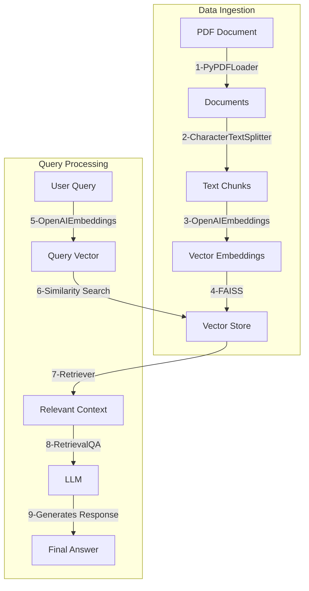

# RAG Basic System

This project implements a basic Retrieval-Augmented Generation (RAG) system using Python, LangChain, and OpenAI. It allows users to query information from a PDF document.

## Features

-   **PDF Loading**: Loads a PDF document from the `input` directory.
-   **Text Splitting**: Splits the document into manageable chunks for processing.
-   **Vector Store**: Uses FAISS and OpenAI Embeddings to create a searchable vector index.
-   **Interactive QA**: Provides a command-line interface for users to ask questions about the PDF content.
-   **LangChain Integration**: Utilizes LangChain for efficient chaining of components.

## Prerequisites

-   Python 3.8 or higher
-   An OpenAI API Key

## Installation

1.  **Clone the repository** (if applicable) or navigate to the project directory.

2.  **Install dependencies**:
    ```bash
    pip3 install -r requirements.txt
    ```

3.  **Set up Environment Variables**:
    -   Create a `.env` file in the root directory.
    -   Add your OpenAI API key:
        ```env
        OPENAI_API_KEY=your_openai_api_key_here
        ```

## Usage

1.  **Prepare Input**:
    -   Place your PDF file in the `input` directory.
    -   Ensure the filename matches the one in `main.py` (default: `rag_input_1.pdf`) or update the code to match your filename.

2.  **Run the Application**:
    ```bash
    python3 main.py
    ```

3.  **Interact**:
    -   The system will initialize and index the document.
    -   Type your question when prompted.
    -   Type `exit` to quit the application.

## Project Structure

-   `main.py`: The main script containing the RAG logic and interactive loop.
-   `requirements.txt`: List of Python dependencies.
-   `input/`: Directory to store input PDF files.
-   `.env`: Configuration file for API keys (not committed to version control).

## Dependencies

The project relies on the following key libraries:

-   **`langchain`**: The core framework for building applications with Large Language Models (LLMs). It provides the structure for chains, agents, and retrieval strategies.
-   **`openai`**: The official Python client for the OpenAI API, used here to access models like `gpt-4o-mini` and embedding models.
-   **`faiss-cpu`**: A library for efficient similarity search and clustering of dense vectors. It is used to store and retrieve the document embeddings.
-   **`pypdf`**: A pure Python library used by `PyPDFLoader` to read and extract text from PDF files.
-   **`python-dotenv`**: Reads key-value pairs from a `.env` file and sets them as environment variables, used for managing the API key securely.

## Architecture


## How it Works

### Data Ingestion 
**This stage is run once to prepare the custom data (the PDF) so the LLM can use it.**
1. **PDF Document $\rightarrow$ Documents:** The process begins with your PDF Document. The ***PyPDFLoader*** tool reads the PDF and converts its contents into a list of digital Documents, which are essentially strings of text.
2. **Documents $\rightarrow$ Text Chunks:** The long text documents are too large for the LLM to process all at once, hence the ***CharacterTextSplitter*** breaks the text into smaller, manageable, fixed-size Text Chunks. This is a crucial step for efficient retrieval.
3. **Text Chunks $\rightarrow$ Vector Embeddings:** Each text chunk is passed to ***OpenAIEmbeddings***. This service converts the meaning and context of the text chunk into a list of numbers called a Vector Embedding. Texts with similar meanings will have vectors that are numerically "close" to each other.
4. **Vector Embeddings $\rightarrow$ Vector Store:** Finally, all the vector embeddings are stored in a ***FAISS index***. FAISS is a library designed for efficient similarity search, acting as the Vector Store. This store is the specialized, searchable knowledge base.

### Query Processing
**This stage runs every time a user asks a question.**
1. **User Query $\rightarrow$ Query Vector:** When the User Query comes in, it is also converted into a Query Vector using the exact same ***OpenAIEmbeddings*** process used during ingestion. This ensures the query and the documents are represented in the same mathematical space.
2. **Query Vector $\rightarrow$ Vector Store $\rightarrow$ Relevant Context:** The query vector is used to perform a ***Similarity Search*** against the Vector Store. This search identifies the stored vector embeddings that are mathematically closest (most similar in meaning) to the user's question. A ***Retriever*** then fetches the original text chunks corresponding to those vectors, resulting in the Relevant Context.
3. **Relevant Context $\rightarrow$ LLM:** The retrieved Relevant Context is combined with the original User Query and passed to the LLM (Large Language Model). This entire process is managed by the ***RetrievalQA*** chain, which effectively creates a prompt telling the LLM to answer the user's question only using the following context.
4. **LLM $\rightarrow$ Final Answer:** The LLM processes the query and the provided context to generate a concise, accurate Final Answer.

## Key Parameters

Understanding these parameters helps in tuning the performance of the RAG system:

-   **`chunk_size` (default: 500)**:
    -   Defines the maximum number of characters in each text chunk.
    -   *Impact*: Smaller chunks might miss context, while larger chunks might contain irrelevant information or exceed the LLM's context window.

-   **`chunk_overlap` (default: 100)**:
    -   Defines the number of characters that overlap between consecutive chunks.
    -   *Impact*: Ensures that context is not lost at the boundaries of chunks. A higher overlap helps in maintaining continuity but increases redundancy.

-   **`FAISS` (Vector Store)**:
    -   Facebook AI Similarity Search. It indexes the vector embeddings of the text chunks.
    -   *Usage*: It allows for extremely fast retrieval of the most relevant chunks based on the cosine similarity between the query vector and the document vectors.

-   **`RetrievalQA` (Chain)**:
    -   A specific type of LangChain chain designed for Question Answering over an index.
    -   *Usage*: It orchestrates the entire process: taking the user's question, retrieving relevant documents from FAISS, and passing both the question and the documents to the LLM to generate an answer.